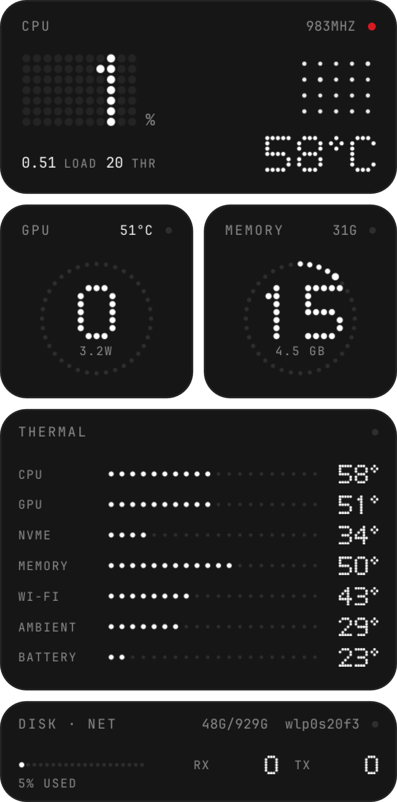

# Nothing Widgets

Desktop widgets for [Omarchy](https://omarchy.org) in the design language of
Nothing OS: black material, dot-matrix numerals, hairline tiles, and one red
LED. The first widget is a system monitor that sits on the desktop layer,
above the wallpaper and below your windows.

<p align="center">
  
</p>

## What it shows

| Tile          | Contents                                                                                       |
|---------------|------------------------------------------------------------------------------------------------|
| CPU           | Load percentage as a dot-matrix hero, current clock, load average, thread count, a per-thread dot matrix, and the package temperature. The red LED is lit while samples are fresh. |
| GPU           | Utilisation ring, power draw, and temperature. Understands NVIDIA runtime power management: a suspended dGPU shows `sleep` instead of being woken up to ask. AMD sysfs is used when there is no NVIDIA card. |
| MEMORY        | Used percentage ring, used GiB, and total.                                                     |
| THERMAL       | One row per sensor: name, a dot bar scaled from 20 °C to the sensor's high threshold, and the reading. Sensors above their high threshold turn red; the tile's trailing text says `hot` or `critical`. |
| DISK · NET    | Root filesystem usage bar with used/total, plus receive and transmit rates on the primary interface. |

Every grey is derived from the active Omarchy theme's foreground and
background colours, so the widget stays coherent on themes other than
Nothing. The accent colour is used only for the live LED and for alerts.

## Requirements

- Omarchy 4.0 or later (the Quickshell-based `omarchy-shell`).
- `python3` (standard library only).
- Optional: `nvidia-smi` for NVIDIA GPU readings.

The collector reads `/proc` and `/sys` directly. Temperatures come from
hwmon, so whatever your kernel exposes (coretemp, `dell_ddv`, `nvme`,
`iwlwifi`, `BAT0`, ...) is what the THERMAL tile lists.

## Install

```sh
omarchy plugin add https://github.com/Romulus828/nothing-widgets.git --enable
```

Omarchy clones the repository into
`~/.config/omarchy/plugins/io.github.romulus828.nothing-widgets/`, validates
the manifest, and asks whether to enable it. Later updates:

```sh
omarchy plugin update io.github.romulus828.nothing-widgets
```

To turn it off or remove it:

```sh
omarchy plugin disable io.github.romulus828.nothing-widgets
omarchy plugin remove io.github.romulus828.nothing-widgets
```

## Controls

The widget registers an IPC target named `nothing-widgets`:

```sh
omarchy-shell nothing-widgets toggle          # show or hide (persisted)
omarchy-shell nothing-widgets show
omarchy-shell nothing-widgets hide
omarchy-shell nothing-widgets refresh         # restart the collector now
omarchy-shell nothing-widgets status          # JSON: shown, collector state, sample age, screens
omarchy-shell nothing-widgets snapshot ~/widget.png   # render the widget to a PNG
```

Clicking the widget runs the `clickCommand` setting, which opens `btop` by
default.

A keybinding for the toggle is a one-liner in `~/.config/hypr/bindings.conf`:

```
bindd = SUPER SHIFT, N, Toggle desktop widgets, exec, omarchy-shell nothing-widgets toggle
```

## Settings

Settings live inline on the plugin's entry in `~/.config/omarchy/shell.json`.
Every key is optional; the defaults are shown here.

```json
{
  "plugins": [
    {
      "id": "io.github.romulus828.nothing-widgets",
      "position": "top-right",
      "marginX": 16,
      "marginY": 16,
      "scale": 1.0,
      "interval": 2,
      "screen": "",
      "visible": true,
      "tiles": ["cpu", "gpu", "mem", "thermal", "disk", "net"],
      "sensors": [],
      "tileAlpha": 1.0,
      "clickCommand": "omarchy-launch-or-focus-tui btop"
    }
  ]
}
```

| Key            | Meaning                                                                                                    |
|----------------|------------------------------------------------------------------------------------------------------------|
| `position`     | `top-left`, `top`, `top-right`, `left`, `center`, `right`, `bottom-left`, `bottom`, `bottom-right`.        |
| `marginX`, `marginY` | Distance in pixels from the screen edge. The bar's exclusive zone is respected on top of this.        |
| `scale`        | Size multiplier, 0.5 to 3. The widget is 300 px wide at scale 1.                                           |
| `interval`     | Seconds between samples, minimum 0.5.                                                                      |
| `screen`       | Connector name such as `eDP-1` or `DP-1` to show on one screen only. Empty means every screen.             |
| `visible`      | Written by `show`, `hide`, and `toggle`; set it by hand if you prefer.                                     |
| `tiles`        | Which tiles to draw, in any subset of `cpu`, `gpu`, `mem`, `thermal`, `disk`, `net`. GPU and MEMORY share a row and widen to fill it when the other is absent. |
| `sensors`      | Restrict the THERMAL rows to these ids: `cpu`, `gpu`, `nvme`, `mem`, `wifi`, `ambient`, `battery`. Empty shows every sensor the machine reports. |
| `tileAlpha`    | Tile opacity, 0 to 1. Tiles are opaque by default because that is how Nothing draws them.                  |
| `clickCommand` | Shell command run on click. Empty disables the click.                                                      |

The shell picks up changes to `shell.json` live.

## How it works

`collector.py` is a long-running Python process started by the plugin. Every
`interval` seconds it prints one JSON line with CPU, memory, GPU, disk,
network, battery, temperature, and fan readings. Each section is guarded
independently, so a missing sensor leaves a `null` rather than breaking the
stream. It costs about 40 ms of CPU per sample and spawns no subprocesses
except `nvidia-smi`, and that only while the dGPU is awake.

`Desktop.qml` is the plugin's service entry point. It owns the collector,
restarts it with backoff if it exits, exposes the IPC target, and creates one
layer-shell window per screen on the `bottom` layer with a zero exclusive
zone. `widgets/SystemMonitor.qml` lays out the tiles, and `components/`
holds the dot-matrix primitives: `DotText` (a 5x7 dot font), `DotRing`,
`DotBar`, `DotMatrix`, and the `Tile` frame.

If the collector stops delivering samples, the LED goes hollow and the dots
dim to grey rather than freezing on stale numbers.

## Development

Clone the repository somewhere and point Omarchy at it with a `file://` URL,
which gives you a git-managed install you can update with
`omarchy plugin update` after each commit:

```sh
git clone https://github.com/Romulus828/nothing-widgets.git ~/Work/nothing-widgets
omarchy plugin add file://$HOME/Work/nothing-widgets --enable --yes
```

Two things to know when editing:

- Saving a file inside the installed plugin folder triggers a plugin reload,
  but the shell's QML component cache keeps serving the old code. After QML
  changes run `omarchy restart shell`, which costs about a second of bar
  flicker.
- `omarchy-shell nothing-widgets snapshot /path/out.png` renders the widget
  off-screen, so you can check a layout without switching workspaces.

Run the collector by hand to see the raw data:

```sh
python3 collector.py --once | tail -n 1 | python3 -m json.tool   # --once emits two samples so rates are valid
```

Validate the manifest before committing:

```sh
omarchy plugin validate .
```

## License

MIT. See [LICENSE](LICENSE).
