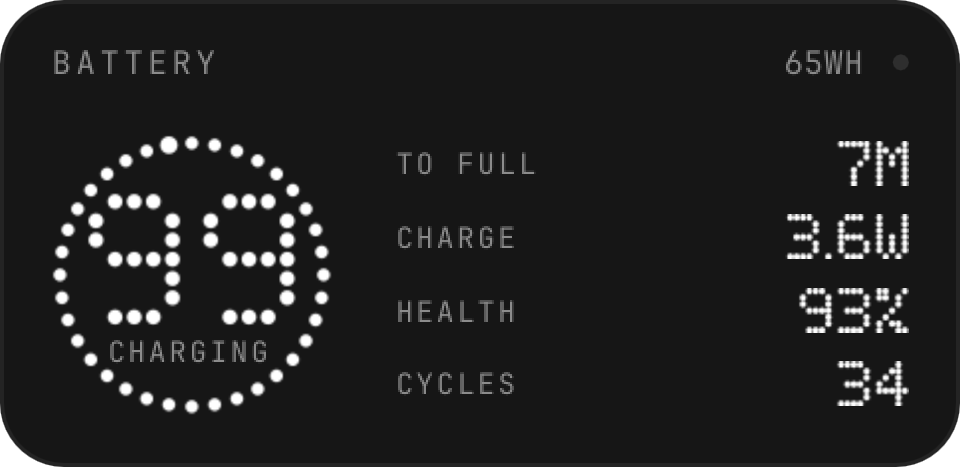
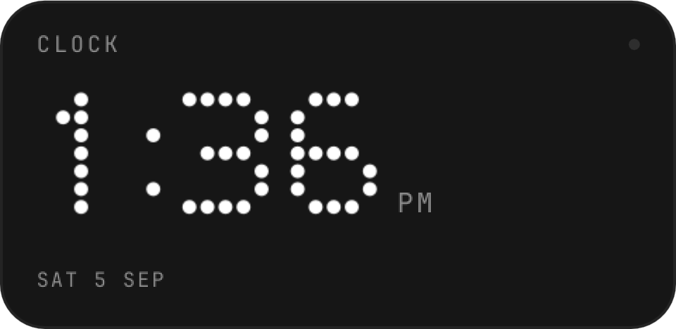
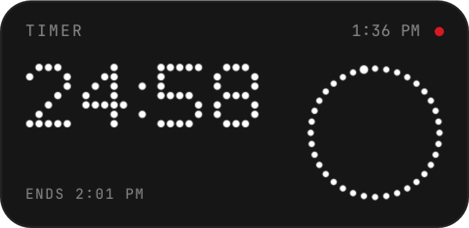
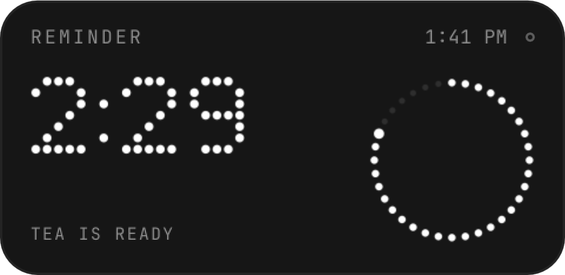
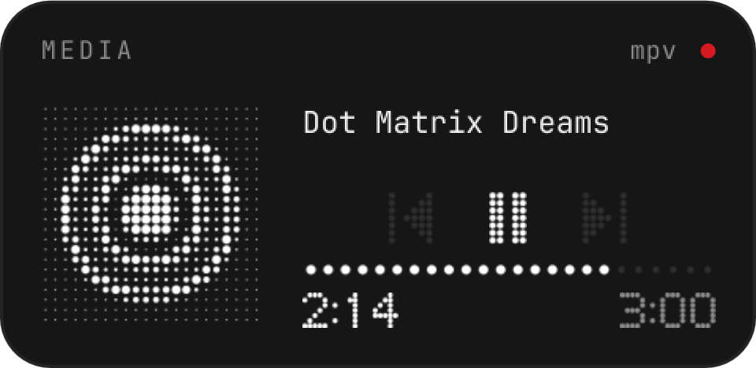
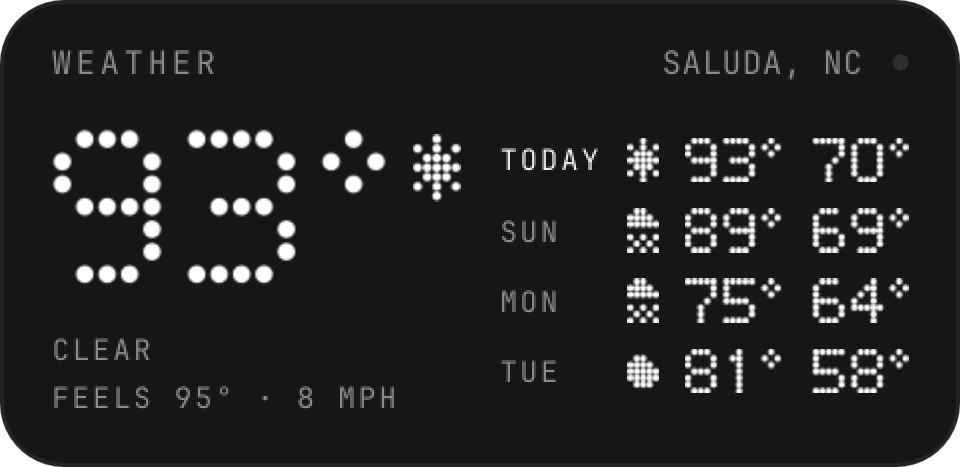

# Nothing Widgets

Desktop widgets for [Omarchy](https://omarchy.org) in the design language of
Nothing OS: black material, dot-matrix numerals, hairline tiles, and one red
LED. They sit on the desktop layer, above the wallpaper and below your
windows. Five widgets so far: a system monitor, a battery tile, a clock
that doubles as a timer, a media tile, and weather.

<p align="center">
  
  <br>
  
  <br>
  
  
  
</p>

## System monitor

| Tile          | Contents                                                                                       |
|---------------|------------------------------------------------------------------------------------------------|
| CPU           | Load percentage as a dot-matrix hero, current clock, load average, thread count, a per-thread dot matrix, and the package temperature. The red LED is lit while samples are fresh. |
| GPU           | Utilisation ring, power draw, and temperature. Understands NVIDIA runtime power management: a suspended dGPU shows `sleep` instead of being woken up to ask. AMD sysfs is used when there is no NVIDIA card. |
| MEMORY        | Used percentage ring, used GiB, and total.                                                     |
| THERMAL       | One row per sensor: name, a dot bar scaled from 20 °C to the sensor's high threshold, and the reading. Sensors above their high threshold turn red; the tile's trailing text says `hot` or `critical`. |
| DISK · NET    | Root filesystem usage bar with used/total, plus receive and transmit rates on the primary interface. |

## Battery

A single tile at the top-right (the monitor takes the top-left): charge ring with the percentage and state (`charging`,
`full`, `on ac`, `on battery`), then time to full or time left, charge or
draw in watts, health as a percentage of design capacity, and the cycle
count. The trailing text is the pack's current energy in Wh. The LED and
numerals go red when the charge drops to `lowAt` percent while discharging.
The tile hides itself on machines without a battery.

## Clock and timer

One tile with two modes. As a clock it shows the time in big dot numerals
with the date underneath, and nothing that moves: no seconds, one repaint a
minute. Start a timer and the countdown takes the hero, a dot ring drains
beside it, the current time moves to the trailing text, and the LED lights.
When the timer ends the numerals turn red, the LED blinks, three beeps play
(`sounds/timer.wav`, through PipeWire, PulseAudio, or ALSA, whichever is
there), and `doneCommand` runs (a critical `notify-send` by default). The finished timer is dismissed
by a click or on its own after two minutes.

Left click pauses or resumes a running timer; right click cancels it. The
hour format follows the bar's clock widget unless you set `format`. A
running timer survives a shell restart.

**Omarchy reminders show here too.** Set one the usual way, with
`SUPER+CTRL+R`, `omarchy reminder 25 "Tea"`, or the reminders overlay, and
the tile counts down to it with the message as the caption, the LED
hollow until the final minute. When it fires, Omarchy sends its notification
and the tile returns to the clock. With several reminders pending the tile
shows the soonest and a `+N`. A manual timer takes priority over reminders
while it runs.

```sh
omarchy-shell nothing-widgets timer 25m       # also 90s, 1h30m, 1h30, 10:00, 1:30:00, or a bare 25 (minutes)
omarchy-shell nothing-widgets timer pause
omarchy-shell nothing-widgets timer resume    # or `timer toggle`
omarchy-shell nothing-widgets timer stop
omarchy-shell nothing-widgets timer status    # idle | running 24:59 | paused 24:59 | done
omarchy-shell nothing-widgets reminders       # JSON list of pending Omarchy reminders
omarchy-shell nothing-widgets weather         # JSON: place, units, age, last report
```

Keybindings make the timer useful. In `~/.config/hypr/bindings.conf`:

```
bindd = SUPER SHIFT, T, Start a 25 minute timer, exec, omarchy-shell nothing-widgets timer 25m
bindd = SUPER SHIFT, Y, Pause or resume the timer, exec, omarchy-shell nothing-widgets timer toggle
```

## Media

A slightly taller tile. Album art as a dot raster, with the title, artist, previous / play-pause /
next buttons, a dot progress bar and the position and length beside it. The
LED is the play indicator: lit while playing, hollow while paused. Buttons
the player can't honour (no playlist, say) are dimmed. Clicking the tile
away from the buttons also works: left plays or pauses, right skips ahead,
middle goes back. The tile hides itself when no player has anything loaded,
unless `hideWhenIdle` is off.

Which player it shows is decided by Omarchy's own media service, the same
one behind the bar's media widget and the OSD, so the two never disagree.
Anything that speaks MPRIS works: Spotify, browsers, mpv with `mpv-mpris`,
and so on. Art comes from whatever the player reports, local file or URL.

## Weather

Current temperature as the hero numeral with a condition glyph, the
condition and feels-like and wind beneath, and a four-day forecast on the
right with dot glyphs, highs and lows. The LED lights only for severe
weather (heavy rain, thunderstorms, hail) and goes hollow while the report
is stale.

It uses the same location as Omarchy's bar weather widget, read from
`~/.local/state/omarchy/settings/weather.json`, so set the place once in
the bar's weather popup and both agree. Units follow the bar widget's
`unit` setting, else your locale; override with `unit`. Reports come from
open-meteo every `refreshMinutes`. By default the tile takes the top centre
of the screen, its own column between the two stacks.

Every grey is derived from the active Omarchy theme's foreground and
background colours, so the widgets stay coherent on themes other than
Nothing. The accent colour is used only for the live LED and for alerts.

## Requirements

- Omarchy 4.0 or later (the Quickshell-based `omarchy-shell`).
- `python3` (standard library only).
- Optional: `nvidia-smi` for NVIDIA GPU readings.

The collector reads `/proc` and `/sys` directly. Temperatures come from
hwmon, so whatever your kernel exposes (coretemp, `dell_ddv`, `nvme`,
`iwlwifi`, `BAT0`, ...) is what the THERMAL tile lists.

## Install

```sh
omarchy plugin add https://github.com/Romulus828/nothing-widgets.git --enable
```

Omarchy clones the repository into
`~/.config/omarchy/plugins/io.github.romulus828.nothing-widgets/`, validates
the manifest, and asks whether to enable it. Later updates:

```sh
omarchy plugin update io.github.romulus828.nothing-widgets
sleep 3 && omarchy restart shell    # QML changes need a restart; the pause avoids a Quickshell exit crash
```

To turn it off or remove it:

```sh
omarchy plugin disable io.github.romulus828.nothing-widgets
omarchy plugin remove io.github.romulus828.nothing-widgets
```

## Controls

The widget registers an IPC target named `nothing-widgets`:

```sh
omarchy-shell nothing-widgets toggle          # show or hide everything (persisted)
omarchy-shell nothing-widgets show
omarchy-shell nothing-widgets hide
omarchy-shell nothing-widgets toggleWidget battery    # one widget: monitor | battery | clock | media | weather
omarchy-shell nothing-widgets showWidget battery
omarchy-shell nothing-widgets hideWidget monitor
omarchy-shell nothing-widgets refresh         # restart the collector now
omarchy-shell nothing-widgets status          # JSON: shown, collector state, widgets, windows, screens
omarchy-shell nothing-widgets snapshot ~/w.png              # render the first window to a PNG
omarchy-shell nothing-widgets snapshotAt ~/b.png top-left   # render the window at a position
omarchy-shell nothing-widgets timer 25m       # see Clock and timer above
```

Clicking a widget runs its `clickCommand` setting. The monitor opens `btop`
by default; the battery and clock tiles do nothing until you give them a
command (the clock's clicks control the timer while one is running).

A keybinding for the toggle is a one-liner in `~/.config/hypr/bindings.conf`:

```
bindd = SUPER SHIFT, N, Toggle desktop widgets, exec, omarchy-shell nothing-widgets toggle
```

## Settings

Settings live inline on the plugin's entry in `~/.config/omarchy/shell.json`.
Top-level keys apply to every widget. Each widget has its own object under
`widgets` that can add its own keys or override a shared one. Every key is
optional; the defaults are shown here.

```json
{
  "plugins": [
    {
      "id": "io.github.romulus828.nothing-widgets",
      "visible": true,
      "scale": 1.0,
      "interval": 2,
      "marginX": 16,
      "marginY": 16,
      "screen": "",
      "tileAlpha": 1.0,
      "widgets": {
        "monitor": {
          "visible": true,
          "position": "top-left",
          "tiles": ["cpu", "gpu", "mem", "thermal", "disk", "net"],
          "sensors": [],
          "clickCommand": "omarchy-launch-or-focus-tui btop"
        },
        "battery": {
          "visible": true,
          "position": "top-right",
          "lowAt": 15,
          "clickCommand": ""
        },
        "clock": {
          "visible": true,
          "position": "top-right",
          "format": "auto",
          "doneCommand": "notify-send -u critical 'Timer done'",
          "doneSound": "default",
          "clickCommand": ""
        },
        "media": {
          "visible": true,
          "position": "top-right",
          "hideWhenIdle": true,
          "clickCommand": ""
        },
        "weather": {
          "visible": true,
          "position": "top",
          "unit": "",
          "refreshMinutes": 15,
          "clickCommand": ""
        }
      }
    }
  ]
}
```

Shared keys:

| Key            | Meaning                                                                                                    |
|----------------|------------------------------------------------------------------------------------------------------------|
| `visible`      | Master switch. Written by `show`, `hide`, and `toggle`.                                                    |
| `scale`        | Size multiplier, 0.5 to 3. Widgets are 300 px wide at scale 1.                                             |
| `interval`     | Seconds between samples, minimum 0.5.                                                                      |
| `marginX`, `marginY` | Distance in pixels from the screen edge. The bar's exclusive zone is respected on top of this.        |
| `screen`       | Connector name such as `eDP-1` or `DP-1` to show on one screen only. Empty means every screen.             |
| `tileAlpha`    | Tile opacity, 0 to 1. Tiles are opaque by default because that is how Nothing draws them.                  |

Per-widget keys (`scale`, `marginX`, `marginY`, `screen`, and `tileAlpha` may
also be set here to override the shared value for one widget):

| Key            | Widget   | Meaning                                                                                          |
|----------------|----------|--------------------------------------------------------------------------------------------------|
| `visible`      | all      | Written by `showWidget`, `hideWidget`, and `toggleWidget`.                                       |
| `position`     | all      | `top-left`, `top`, `top-right`, `left`, `center`, `right`, `bottom-left`, `bottom`, `bottom-right`. Widgets given the same position stack in that corner in the order monitor, battery, clock, media, weather. |
| `clickCommand` | all      | Shell command run on click. Empty disables the click.                                            |
| `tiles`        | monitor  | Which tiles to draw, in any subset of `cpu`, `gpu`, `mem`, `thermal`, `disk`, `net`. GPU and MEMORY share a row and widen to fill it when the other is absent. |
| `sensors`      | monitor  | Restrict the THERMAL rows to these ids: `cpu`, `gpu`, `nvme`, `mem`, `wifi`, `ambient`, `battery`. Empty shows every sensor the machine reports. |
| `lowAt`        | battery  | Percent at which the battery tile turns red while discharging.                                   |
| `format`       | clock    | `auto` follows the bar's clock widget, else `12h` or `24h`.                                      |
| `doneCommand`  | clock    | Shell command run when a timer ends. Empty to skip it.                                           |
| `unit`         | weather  | `metric` or `imperial`. Empty follows the bar's weather widget, else the locale.                   |
| `refreshMinutes` | weather | Minutes between reports, minimum 5.                                                              |
| `hideWhenIdle` | media    | Hide the tile while no player has a track loaded. Off shows a "nothing playing" tile.               |
| `doneSound`    | clock    | `default` plays the bundled beeps, `""` is silent, or give a path to your own sound file. Regenerate the default with `tools/make-sounds.py`. |

For compatibility the monitor also reads `position`, `tiles`, `sensors`, and
`clickCommand` from the top level of the entry.

The shell picks up changes to `shell.json` live.

## How it works

`collector.py` is a long-running Python process started by the plugin. Every
`interval` seconds it prints one JSON line with CPU, memory, GPU, disk,
network, battery, temperature, and fan readings. Each section is guarded
independently, so a missing sensor leaves a `null` rather than breaking the
stream. It costs about 40 ms of CPU per sample and spawns no subprocesses
except `nvidia-smi`, and that only while the dGPU is awake.

`Desktop.qml` is the plugin's service entry point. It owns the collector,
restarts it with backoff if it exits, exposes the IPC target, and creates
the layer-shell windows on the `bottom` layer with a zero exclusive zone:
one per screen and corner that has a widget, with widgets that share a
corner stacked. `widgets/SystemMonitor.qml`, `widgets/Battery.qml`, `widgets/Clock.qml`,
`widgets/Media.qml`, and `widgets/Weather.qml` lay out the tiles (timer state lives in
`Desktop.qml` so every screen shows the same countdown), and `components/` holds the shared parts: `Palette` (theme
derived colours), `Tile` (the frame), and the dot-matrix primitives
`DotText` (a 5x7 dot font), `DotRing`, `DotBar`, `DotMatrix`, `DotImage`
(an image as a dot raster), and `RingGauge`.

If the collector stops delivering samples, the LED goes hollow and the dots
dim to grey rather than freezing on stale numbers.

## Development

Clone the repository somewhere and point Omarchy at it with a `file://` URL,
which gives you a git-managed install you can update with
`omarchy plugin update` after each commit:

```sh
git clone https://github.com/Romulus828/nothing-widgets.git ~/Work/nothing-widgets
omarchy plugin add file://$HOME/Work/nothing-widgets --enable --yes
```

Two things to know when editing:

- Saving a file inside the installed plugin folder triggers a plugin reload,
  but the shell's QML component cache keeps serving the old code. After QML
  changes run `omarchy restart shell`, which costs about a second of bar
  flicker. Give the reload a few seconds to settle first: restarting the
  shell while a reload is still creating objects can crash Quickshell 0.3.1
  on exit (it relaunches itself, but shows a crash dialog). This applies to
  `omarchy plugin update` too, since it writes the same files.
- `omarchy-shell nothing-widgets snapshot /path/out.png` renders the widget
  off-screen, so you can check a layout without switching workspaces.
- `omarchy-shell nothing-widgets debug` dumps each window's size, visibility,
  and widget slots, which is the first thing to look at when a window does
  not appear.

Run the collector by hand to see the raw data:

```sh
python3 collector.py --once | tail -n 1 | python3 -m json.tool   # --once emits two samples so rates are valid
```

Validate the manifest before committing:

```sh
omarchy plugin validate .
```

## License

MIT. See [LICENSE](LICENSE).
